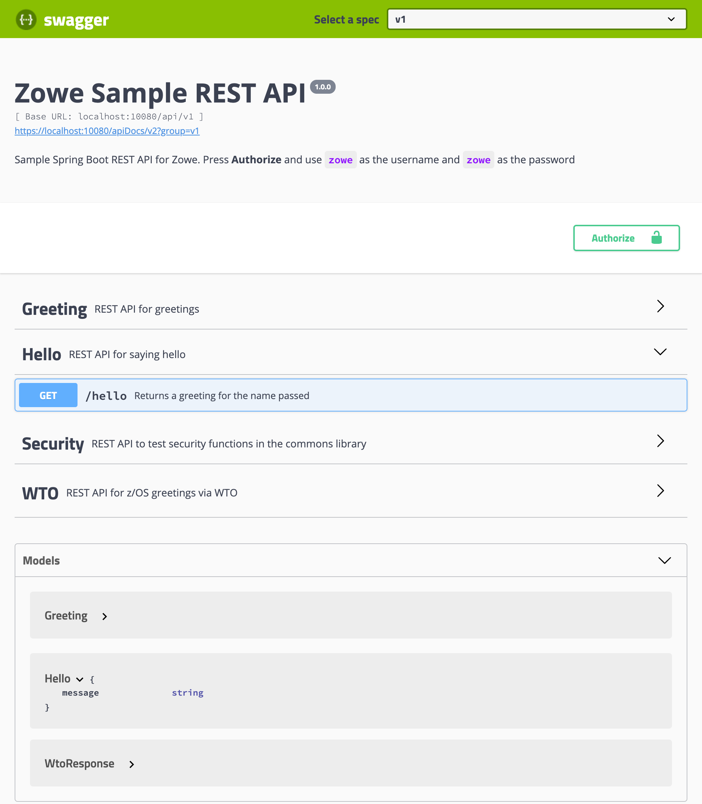

# Adding New REST Controller

After you configure your application, you can add a new controller that implements a new `/api/v1/hello` endpoint.

## Follow the Steps

1. Choose a Java package name. If the base package name is `org.zowe.sample.apiservice` then a package name for your REST controller can be `org.zowe.sample.apiservice.hello`. Try to keep all code (configuration, error handling, data access, JNI wrapper) related to the functionality under the package name.

2. Define data class `org.zowe.sample.apiservice.hello.Hello` with the data returned or requested by the API. We recommend to use Lombok [@Data](https://projectlombok.org/features/Data) annotations.

    **/src/main/java/org/zowe/sample/apiservice/hello/Hello.java**:

    ```java
    package org.zowe.sample.apiservice.hello;

    import lombok.Data;

    @Data
    public class Hello {
        private final String message;
    }
    ```

3. Add a new test `org.zowe.sample.apiservice.hello.HelloControllerTests` with the following code:

    **/src/test/java/org/zowe/sample/apiservice/hello/HelloControllerTests.java:**

    ```java
    package org.zowe.sample.apiservice.hello;

    import static org.hamcrest.CoreMatchers.is;
    import static org.springframework.test.web.servlet.request.MockMvcRequestBuilders.get;
    import static org.springframework.test.web.servlet.result.MockMvcResultMatchers.jsonPath;
    import static org.springframework.test.web.servlet.result.MockMvcResultMatchers.status;

    import org.junit.Test;
    import org.junit.runner.RunWith;
    import org.springframework.beans.factory.annotation.Autowired;
    import org.springframework.boot.test.autoconfigure.web.servlet.WebMvcTest;
    import org.springframework.http.MediaType;
    import org.springframework.test.context.junit4.SpringRunner;
    import org.springframework.test.web.servlet.MockMvc;

    @RunWith(SpringRunner.class)
    @WebMvcTest(HelloController.class)
    public class HelloControllerTests {
        @Autowired
        private MockMvc mvc;

        @Test
        public void returnsGreeting() throws Exception {
            mvc.perform(get("/api/v1/hello").contentType(MediaType.APPLICATION_JSON)).andExpect(status().isOk())
                    .andExpect(jsonPath("$.message", is("Hello, world!")));
        }
    }
    ```

4. Add a new controller class `org.zowe.sample.apiservice.hello.HelloController` with the following code:

    **/src/main/java/org/zowe/sample/apiservice/hello/HelloController.java:**

    ```java
    package org.zowe.sample.apiservice.hello;

    import org.springframework.web.bind.annotation.GetMapping;
    import org.springframework.web.bind.annotation.RequestMapping;
    import org.springframework.web.bind.annotation.RequestParam;
    import org.springframework.web.bind.annotation.RestController;

    import io.swagger.annotations.Api;
    import io.swagger.annotations.ApiOperation;
    import io.swagger.annotations.ApiParam;

    @Api(tags = "Hello", description = "REST API for saying hello")
    @RestController
    @RequestMapping("/api/v1/hello")
    public class HelloController {
        @ApiOperation(value = "Returns a greeting for the name passed", nickname = "helloToSomeone")
        @GetMapping
        public Hello hello(
                @ApiParam(value = "Person or object to be greeted", required = false) @RequestParam(value = "name", defaultValue = "world") String name) {
            return new Hello(String.format("Hello, %s!", name));
        }
    }
    ```

5. Allow unauthenticated access to this endpoint. They require authentication by default. This can be configured in `org.zowe.sample.apiservice.config.WebSecurityConfig` class. Add following line to the `configure(HttpSecurity http)` method:

    ```java
    http.authorizeRequests().antMatchers("/api/v1/hello").permitAll();
    ```

6. Add license headers automatically:

    ```bash
    ./gradlew licenseFormat
    ```

7. Build the application with Gradle. It runs the tests too:

    ```bash
    ./gradlew build
    ```

8. Start the API service:

    ```bash
    ./gradlew bootRun
    ```

9. Verify the new endpoint functionality via a REST API client. For example:

    ```bash
    http --verify=False GET "https://localhost:10080/api/v1/hello?name=world"
    ```

    You should get response:

    ```json
    {
        "message": "Hello, world!"
    }
    ```

    You can use the Swagger UI available at <https://localhost:10080/>:

    

## Swagger Annotations

The contents of the API documentation (Swagger JSON) is customized by adding Swagger annotations. These annotations are added to all Java controllers and the model classes. For example, the controller may contain the following Swagger annotations:

- `@Api` - Marks a class as a Swagger resource
- `@ApiOperation` - Describes an operation or typically an HTTP method against a specific path.
- `@ApiResponses` - A wrapper to allow a list of multiple ApiResponse objects.
- `@ApiResponse` - Describes a possible response of an operation.
- `@ApiParam` - Adds additional meta-data for operation parameters.
- `@Authorization` - Declares an authorization scheme to be used on a resource or an operation.

You can find description on them at [Swagger-Core Annotations](https://github.com/swagger-api/swagger-core/wiki/Annotations-1.5.X) and [Package io.swagger.annotations](http://docs.swagger.io/swagger-core/v1.5.0/apidocs/index.html).

## Guides

The following guides illustrate how to use some features concretely:

- [Building a RESTful Web Service](https://spring.io/guides/gs/rest-service/)
- [Serving Web Content with Spring MVC](https://spring.io/guides/gs/serving-web-content/)
- [Building REST services with Spring](https://spring.io/guides/tutorials/bookmarks/)
- [Building a RESTful Web Service with Spring Boot Actuator](https://spring.io/guides/gs/actuator-service/)
- [Setting Up Swagger 2 with a Spring REST API](https://www.baeldung.com/swagger-2-documentation-for-spring-rest-api)
