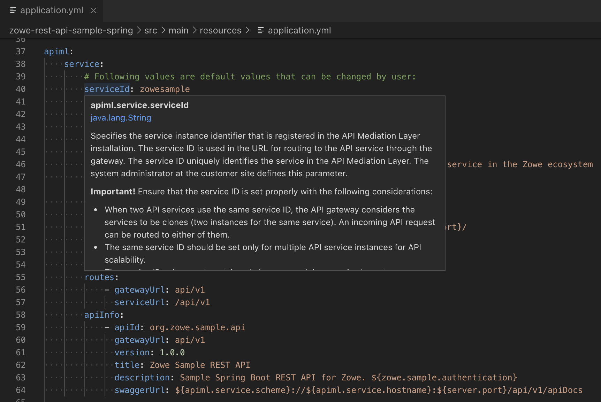

# Change Service Configuration

After you successfully verify that the sample service is functional, you can change the configuration to match your specifications.

The default configuration of your service in in the [src/main/resources/application.yml](../src/main/resources/application.yml). Some of the values (such as port numbers, keystores...) can be overridden externally as described in [Configuration](config.md).

Many of them are meant to be defined by developers and it makes sense to understand them and change them if your application has different needs.

The `application.yml` is split into profiles. The first part is the default profile.
The additional profiles start with:

```yaml
---
spring:
    profiles: profileName
```

The main sections of the properties in `application.yml` are:

- `spring` - Provides Spring Boot configuration properties. There is no need to change the existing ones. You might want to add new properties when you will exploit additional features of the Spring Boot and related projects in future.
- `logging` - Defines the level of log severity that should be displayed for various parts of the code including third-party dependencies. Use to it to display the messages that makes sense to the system administrator in the default profile. You can use more detailed levels in `debug` profile.
- `server` - Defines HTTP server settings
  - `port` - Default server HTTP port. It usually overridden during installation but it makes sense to have a default for development and testing.
  - `ssl` - Default setting for TLS protocol for HTTPS connections. The sample provides defaults that are considered as secure. The values for keystores are provided by external configuration during the installation phase.
- `springfox.documentation.swagger.v2.path: /apiDocs/v2` - URL where the Swagger API documentation JSON document will be provided. No need to change it.
- `zowe.sample` - Values defined by the sample application. Delete them if your application does not use them. `zowe.sample.authentication` is an example of a property that defines different value on z/OS and off z/OS.
- `apiml.service` - Values that define your service for Zowe API Mediation Layer. You will need to change most of them. They are described at Zowe documentation - [Configuration parameters](https://docs.zowe.org/stable/extend/extend-apiml/api-mediation-onboard-an-existing-rest-api-service-without-code-changes.html#configuration-parameters).
  - It is divided into two sections. The first one contains default values that you as developer provide but users are allowed to change them during the configuration of the service. The second part contains values that are set by the service and users should not change them.

**Tip:** Some IDEs provide explanation to the YAML properties if they are provided by the libraries. The SDK provides tips for the important properties. You just need to place the mouse pointer over the property:



This is enabled by [Spring Configuration Metadata](https://docs.spring.io/spring-boot/docs/current/reference/html/configuration-metadata.html).

**Follow these steps to change the default port:**

1. Open the [src/main/resources/application.yml](../src/main/resources/application.yml) file

2. Locate the section `server` and property `port`:

    ```yaml
    server:
        port: 10080
    ```

3. Change the value of the port to a different number from 0 to 65535. You should typically use values from 1024 since the lower values are so called "well-known" ports such as 23 (Telnet), 80 (HTTP), 443 (HTTPS)

4. Restart the service if it is running to see that you configuration is correct

**Set the service ID, title, and other metadata about your service:**

1. Open the [src/main/resources/application.yml](../src/main/resources/application.yml) file

2. Update values in the `apiml.service` section

3. Restart the service if it is running to see that you configuration is correct
