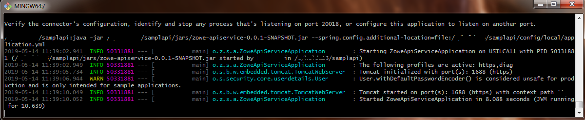
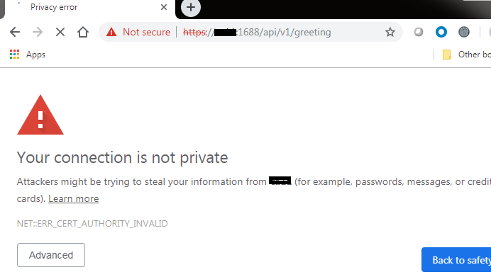
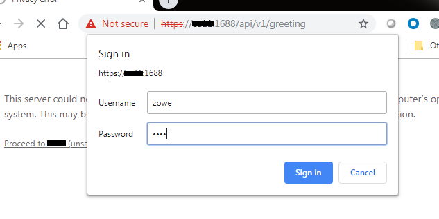
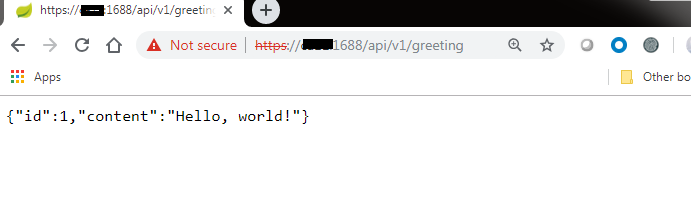

# z/OS Deployment Instructions

There are multiple approaches to deploying the sample API service to z/OS; the following
serves as a reference to deploy the sample API as-is.  For a production instance of an API, your deployment process may differ.

**Note:** Substitute values below for your site configuration

## Manual Deployment

First, create a space to deploy the API artifacts.

Login to [z/OS Unix Shell](https://www.ibm.com/support/knowledgecenter/zosbasics/com.ibm.zos.zconcepts/zconcepts_146.htm).

**Note:** You may need privileged authority to issue the command examples below

1. Allocate and format a [z/OS File System](https://www.ibm.com/support/knowledgecenter/en/SSLTBW_2.3.0/com.ibm.zos.v2r3.bpxb200/zfspref.htm) (zFS):

    - `zfsadm define -aggregate IBMUSER.SAMPLAPI.ZFS -cylinders 200 -volumes WRKD23`
      - (response): `IOEZ00248I VSAM linear dataset IBMUSER.SAMPLAPI.ZFS successfully created.`
    - `zfsadm format -aggregate IBMUSER.SAMPLAPI.ZFS`
      - (response): `IOEZ00077I HFS-compatibility aggregate IBMUSER.SAMPLAPI.ZFS has been successfully created`

2. Create directory and mount the file system:

    - `mkdir /u/ibmuser/samplapi`
    - `/usr/sbin/mount -v -f IBMUSER.SAMPLAPI.ZFS /u/ibmuser/samplapi`
      - response: `FOMF0502I Mount complete for IBMUSER.SAMPLAPI.ZFS`

### Deploy Artifacts

Next, deploy artifacts from your workstation to the zFS.

You can upload artifacts via `ftp`, `sftp`, `scp` or [`Zowe CLI`](https://github.com/zowe/zowe-cli). `zowe` commands will be used in the remaining examples.

#### Deploy the Sample Service API Jar

To obtain the sample service jar, run `gradlew build`. The default artifact will be `build/libs/zowe-rest-api-sample-spring-0.0.1-SNAPSHOT.jar`.

1. Create a directory for the jar and native libraries on z/OS Unix filesytem:

   - `mkdir /u/ibmuser/samplapi/bin`
   - `mkdir /u/ibmuser/samplapi/lib`

2. Upload the `zowe-rest-api-sample-spring-0.0.1-SNAPSHOT.jar` as a binary artifact without the version information:

   - `zowe files upload ftu "build/libs/zowe-rest-api-sample-spring-0.0.1-SNAPSHOT.jar" "/u/ibmuser/samplapi/bin/zowe-rest-api-sample-spring.jar" --binary`

#### Deploy the Sample Service Configuration YAML

1. Create a directory for the `application.yml`:

   - `mkdir /u/ibmuser/samplapi/config`

2. Upload the `config/local/application.yml` as a binary artifact:

   - `zowe files upload ftu "config/local/application.yml" "/u/ibmuser/samplapi/config/application.yml" --binary`

**Note:** If this file is edited on z/OS, it must remain in ASCII format

When the server is started, options will be provided to specify `--spring.config.additional-location` to refer to `config/application.yml`.  Settings in this file will override values found in the same-named `src/main/resources/application.yml`.  For example:

Add `zos` profile, change the port number, and change the paths to keystore and truststore

```yaml
spring.profiles.active: https,diag,zos
#                                 ====

server:
    address: 0.0.0.0
    port: 10080
#         =====
    ssl:
        keyAlias: localhost
        keyPassword: password
        keyStore: config/keystore.p12
#                 ===================
        keyStorePassword: password
        keyStoreType: PKCS12
        trustStore: config/truststore.p12
#                   =====================
        trustStorePassword: password
        trustStoreType: PKCS12
```

**Note:** This uses the existing keystore and truststore for localhost without integration to API ML. If you want to integrate to Zowe API ML, you need to follow the instructions in [Generate a keystore and truststore for a new service on z/OS](https://zowe.github.io/docs-site/latest/extend/extend-apiml/api-mediation-security.html#zowe-runtime-on-z-os) and modify the `application.yml`.

#### Deploy `keystore` and `truststore`

`zowe files upload ftu "config/local/keystore.p12" "/u/ibmuser/samplapi/config/keystore.p12" --binary`

`zowe files upload ftu "config/local/truststore.p12" "/u/ibmuser/samplapi/config/truststore.p12" --binary`

### Native Code

#### Build Native Code

You need to build the native library that provides an example how to call C code on z/OS.
Follow instructions in [z/OS Native OS Linkage](zos-native-os-linkage.md).

#### Extract Native Code

The native `.so` libraries need to be extracted to a LIBPATH directory. The sample JCL expects `.so` file in the root directory of the application.

You can extract them using following commands on z/OS:

```sh
cd /u/ibmuser/samplapi
java -cp bin/zowe-rest-api-sample-spring.jar -Dloader.main=org.zowe.sample.apiservice.LibsExtractor org.springframework.boot.loader.PropertiesLauncher lib
extattr +p lib/*.so
chmod a+x lib/*.so

Extracting lib/libwtojni.so to libwtojni.so
Extracting lib/libzowe-sdk-secur.so to libzowe-sdk-secur.so
```

### Run

Lastly, you can run the sample server from the z/OS Unix Shell, started task, or batch job.

#### Start via Java Commands

Start the server in z/OS Unix via:

```sh
java -Xquickstart -jar bin/zowe-rest-api-sample-spring.jar --spring.config.additional-location=file:config/application.yml
```

Or using `zowe-api`:

```bash
zowe-api start
```

Here is a snippet of the messages seen after startup on z/OS (using git bash terminal and ssh):



Stop the server via:
`Ctrl+C`

#### Start via z/OS Batch Job

Customize the JCL below to run the server as a batch job:

```jcl
//SAMPLAPI JOB ACCT#,'SAMPLE API',MSGCLASS=A,CLASS=B,
//             MSGLEVEL=(1,1),REGION=0M
/*JOBPARM SYSAFF=*
//*
//********************************************************************
//* Custom JVM procedure                                             *
//********************************************************************
//JVMPRC86 PROC JAVACLS=,                < Fully Qfied Java class..RQD
//   ARGS=,                              < Args to Java class
//   VERSION='86',                       < JVMLDM version: 86
//   LOGLVL='',                          < Debug LVL: +I(info) +T(trc)
//   REGSIZE='0M',                       < EXECUTION REGION SIZE
//   LEPARM=''
//JAVAJVM  EXEC PGM=JVMLDM&VERSION,REGION=&REGSIZE,
//   PARM='&LEPARM/&LOGLVL &JAVACLS &ARGS'
//SYSPRINT DD SYSOUT=*          < System stdout
//SYSOUT   DD SYSOUT=*          < System stderr
//STDOUT   DD SYSOUT=*          < Java System.out
//STDERR   DD SYSOUT=*          < Java System.err
//CEEDUMP  DD SYSOUT=*
//CEEOPTS DD *
TRAP(ON,NOSPIE)
/*
//ABNLIGNR DD DUMMY
// PEND
//********************************************************************
//* End Custom JVM procedure                                         *
//********************************************************************
//*
//JAVA EXEC PROC=JVMPRC86,
// PARM='+T'
//STDENV DD *
export PWD=/u/ibmuser/samplapi

export JAVA_HOME=/sys/java64bt/v8r0m0/usr/lpp/java/J8.0_64

CLASSPATH=$PWD/bin/*
export CLASSPATH=$CLASSPATH

LIBPATH=/lib:/usr/lib:$JAVA_HOME/bin
LIBPATH=$LIBPATH:$JAVA_HOME/lib/s390x
LIBPATH=$LIBPATH:$JAVA_HOME/lib/s390x/j9vm
LIBPATH=$LIBPATH:$JAVA_HOME/bin/classic
LIBPATH=$LIBPATH:$PWD
export LIBPATH=$LIBPATH

IJO="-Xms16m -Xmx128m -Xquickstart"
export IBM_JAVA_OPTIONS="${IJO}"

export PATH=$PATH:$JAVA_HOME:$LIBPATH
/*
//MAINARGS DD *
-jar bin/zowe-rest-api-sample-spring-0.0.1-SNAPSHOT.jar
--spring.config.additional-location=\
file:config/application.yml
/*
//STDOUT   DD SYSOUT=*
//STDERR   DD SYSOUT=*
//SYSUDUMP DD SYSOUT=*
```

Stop via: `STOP SAMPLE`.

### Running Example

When the server is started (either through a java command or JCL), you can test the sample `api/v1/greeting` API through your web browser (as you could if they API were running on your workstation).

#### Landing Page

Navigate to the host and port configured in your `config/application.yml`:



#### Sign In

After bypassing the security exception, sign in with `zowe` as the user name and password:



#### Sample API Response

View the sample API response:


